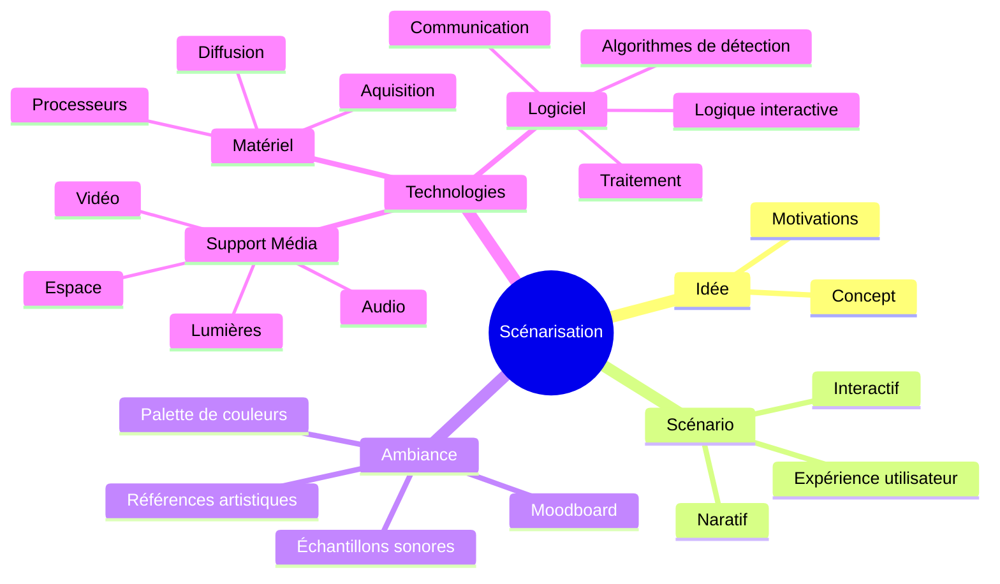

# Scénariser l'interactivité

## Description

Présentation orale du document en ligne (5 à 7 minutes)

Livrable: URL du document en ligne 

L’activité consiste à concevoir une présentation d’un projet multimédia. 

* Présenter une **idée** de projet multimédia
* Expliquer sa structure dans un **scénario** interatif
* Communiquer l'**ambiance** par des références visuelle et sonore 
* Déterminer les **technologies** multimédia nécessaire au projet

Cette activité met l’accent sur la capacité à exprimer une vision créative tout en illustrant les éléments techniques de manière claire.

## Informations pertinentes à communiquer

### Idée

#### Concept

* Présentation du concept central du projet.

#### Objectifs

* Définition des objectifs de l'expérience : quel est le message ou l'émotion que l’on souhaite faire passer ?

#### Motivations

* Discussion des motivations créatives derrière le choix des médias et des technologies.

### Scénario

#### Interactif

* Logigramme de l'interactivité  

#### Narratif

* Développement de la trame narrative durant l'expérience

#### Expérience utilisateur

*  Tracer les possibilités d'exploration de l'utilisateur 

### Ambiance

#### Planche d'ambiances visuelles

* Sert à illustrer l'atmosphère visuelle du projet.
* Utilisation d’images, de palettes de couleurs, de textures pour représenter l’univers artistique.

#### Planche d'ambiances sonores

* Sert à illustrer l'atmosphère sonore du projet.
* Utilisation d'échantillons, de musiques, de textures sonores pour représenter l’univers artistique.

#### Références artistiques

* Explication de l’esthétique et du design choisi, et comment ils renforcent la narration.
* Choix de références visuelles et sonores (films, œuvres d’art, environnements) qui influencent l’expérience.

### Technologies

####  Support médiatique 

* Description des types de médias (vidéo, audio, lumières, capteurs, etc.) et de leur intégration pour créer une expérience immersive.

#### Matériel

* Technologies interactives : Liste des technologies interactives employées (caméras, LIDAR, systèmes RFID, etc.) pour capter et analyser les actions du public en temps réel, permettant de déclencher des événements en réponse.

* Plateformes et outils : Présentation matériels et interfaces interactives nécessaires au projet, comme des logiciels de projection, des systèmes de tracking ou des capteurs intelligents.

#### Logiciels

* Présentation des logiciels et des techniques employée pour réaliser le projet.

* Réseautage et communication : Explication des systèmes de communication entre les différentes composantes (réseaux, protocoles de communication comme OSC ou MIDI, etc.).

## Critères d'évaluation :

### Clarté de l'idée

La présentation de l’idée doit être concise et bien structurée.

### Scénarisation fonctionnelle

Le scénario doit démontrer une bonne compréhension des mécanismes narratifs et interactifs.

### Cohérence esthétique 

Le moodboard doit bien représenter l’univers visuel et sonore de l’expérience.

### Précision technique 

Les choix des technologies multimédia supporte adéquatement l'idée et le concept.

### Présentation générale

Capacité à présenter de manière fluide, avec une utilisation efficace des supports visuels et techniques.

L’objectif de cette activité est de développer des compétences en conception et scénarisation, mais aussi la capacité à articuler une vision créative dans un format de présentation professionnel et engageant.

## Modèle de page Docsify à personaliser

* https://github.com/gllmAR/docsify-modele-classique

## Évaluations associées

* [Évaluation formative 2](/evaluations/?id=ef-2)
* [Évaluation sommative 2](/evaluations/?id=es-2)

## Contenus associées

[Contenus Scenarisation](../../contenus/2_scenarisation/README.md ":include")

