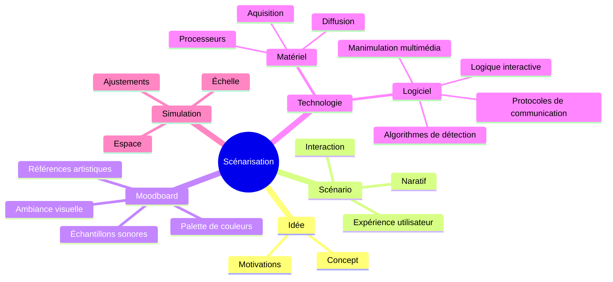

# Scénariser

## Description

Présentation orale du document en ligne (5 à 7 minutes)

Livrable: URL du document en ligne 

L’activité consiste à concevoir une présentation détaillée d’un projet multimédia. 

* Présenter une idée 
* Expliquer sa structure narrative dans un scénario
* Créer un  planche de tendances (*moodboard*) illustrant l'atmosphère visuelle et sonore  

Cette activité met l’accent sur la capacité à exprimer une vision créative tout en illustrant les éléments techniques de manière claire.

## Informations pertinentes à communiquer

1. **L'idée** :
   - Présentation du concept central du projet.
   - Définition des objectifs de l'expérience : quel est le message ou l'émotion que l’on souhaite faire passer ?
   - Discussion des motivations créatives derrière le choix des médias et des technologies.

2. **Le scénario** :
   - Développement d’une trame narrative ou d’un parcours utilisateur dans l’expérience.
   - Définition des différents moments de l’interaction : introduction, développement, et conclusion.
   - Intégration des points d'interaction ou d'intervention de l'utilisateur (exemple : capteurs, interactions visuelles ou sonores).
   - Justification des choix scénaristiques pour soutenir l'immersion et l'engagement du public.

3. **Le moodboard** :
   - Création d’un moodboard (planche d’inspiration) pour illustrer l'atmosphère visuelle et sonore du projet.
   - Utilisation d’images, de palettes de couleurs, de sons ou de textures pour représenter l’univers artistique.
   - Explication de l’esthétique et du design choisi, et comment ils renforcent la narration.
   - Choix de références visuelles et sonores (films, œuvres d’art, environnements) qui influencent l’expérience.

### Critères d'évaluation :
- **Clarté de l'idée** : La présentation de l’idée doit être concise et bien structurée.
- **Scénarisation** : Le scénario doit démontrer une bonne compréhension des mécanismes narratifs et interactifs.
- **Cohérence esthétique** : Le moodboard doit bien représenter l’univers visuel et sonore de l’expérience.
- **Présentation générale** : Capacité à présenter de manière fluide, avec une utilisation efficace des supports visuels et techniques.

L’objectif de cette activité est de développer chez les apprenants non seulement des compétences en conception et scénarisation, mais aussi la capacité à articuler une vision créative dans un format de présentation professionnel et engageant.

## Modèle de page Docsify à personaliser

* https://github.com/gllmAR/docsify-modele-classique

## Évaluations associées

* [Évaluation formative 2](/evaluations/?id=ef-2)
* [Évaluation sommative 2](/evaluations/?id=es-2)

## Contenus associées

[Contenus Scenarisation](../../contenus/2_scenarisation/README.md ":include")

