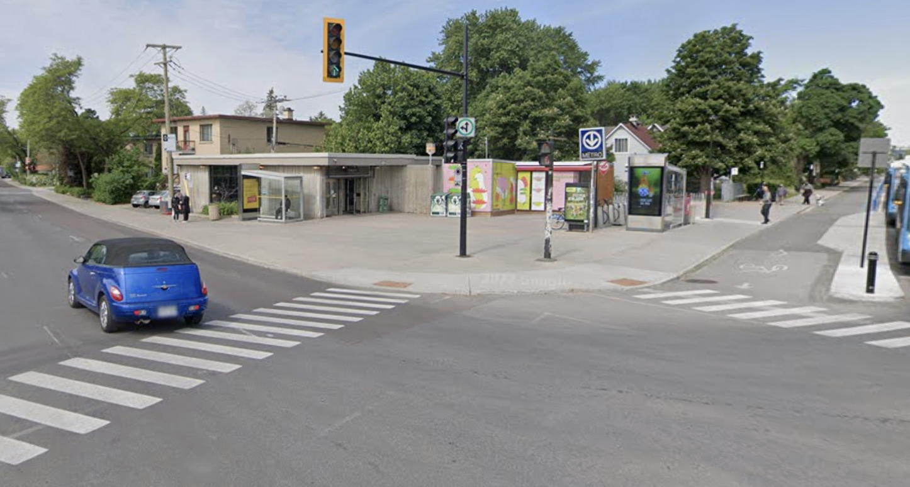

# Sortie Eisode

## Logisitique 

L'activité est gratuite, mais il faut payer le métro 

* Prévoir deux titres de transport, un aller et un retour soit ~10$

### 1er point de rencontre, en classe au début du cours 

* AM = MON-B3358 : 10:45 
* PM = MON-B1387 : 14:25 

### 2e point de rencontre, aux guichets du métro Montmorency
* AM = 10:55
* PM = 14:35

### 3e point de rencontre, aux portes Métro Sauvé coté Nord
    

* AM = 11:15
* PM = 14:55

### Retour, on vise embarquer dans le métro et revenir avant la fin du cours

* AM = ~ 13:00
* PM = ~ 16:30

Ceux qui veulent se rendre directement écrivez le dans cette conversation, ceux qui ont des questions personnelles ou d'autres formes d'enjeux, écrivez-moi directement. 
 
Si vous vous perdez, communiquez avec moi via messages teams.
 
Si vous avez lu le message, merci de faire un pouce en l'air dessus pour me communiquer que vous l'avez lu. 
 
Merci et à bientôt!

