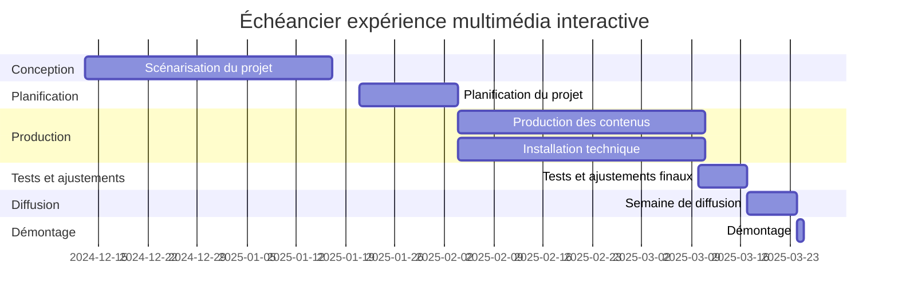

# Concevoir

## Requis Expériences multimédia interactive

* ~30 personnes 
* 7 équipes de ~5 membres
* 7 projets, dimmensions et déploiement variable
    * Dans le grand studio ou à l'extérieur (salle des matrices?)
    * Le petit studio doit demeurer accessible
    * potentiellement ~2 mobiles, 5 installations studio
* un thème qui rassemble 
    * identité visuelle et conceptuelle

## Une présentation par équipe

### Éléments à traiter

#### Concept
* Titre 
* Idée et pitch 
* Comment ça s'intègre dans le thème global

#### Artistique

* Tableau d'ambiances
* Simulation
* Scénarimage
* Scénario interactif

#### Technique 

* Synoptique
* Technologies employées
* Plantation
* Devis technique

#### Gestion d'équipe

* Distribution des responsabilité au sein de l'équipe
* Motivations (individuelles et équipe)
* Étude de risques (issues dans github)

##  Échéancier prochaine session

