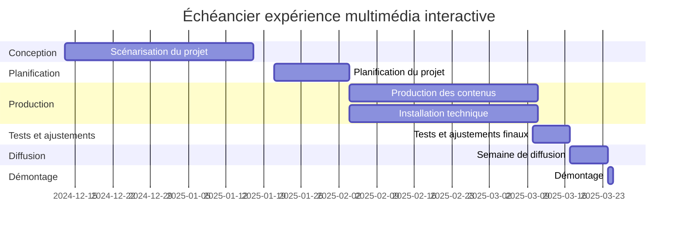

# Concevoir

* Expériences multimédia interactive
* ~30 personnes 
* 6 équipes de ~5 membres
* 6 projets, dimmensions et déploiement variable
    * Dans le grand studio ou à l'extérieur (salle des matrices?)
    * Le petit studio doit demeurer accessible
    * potentiellement 2 mobiles, 4 installations studio
* un thème qui rassemble (identité visuelle, conceptuelle)

##  Échéancier

