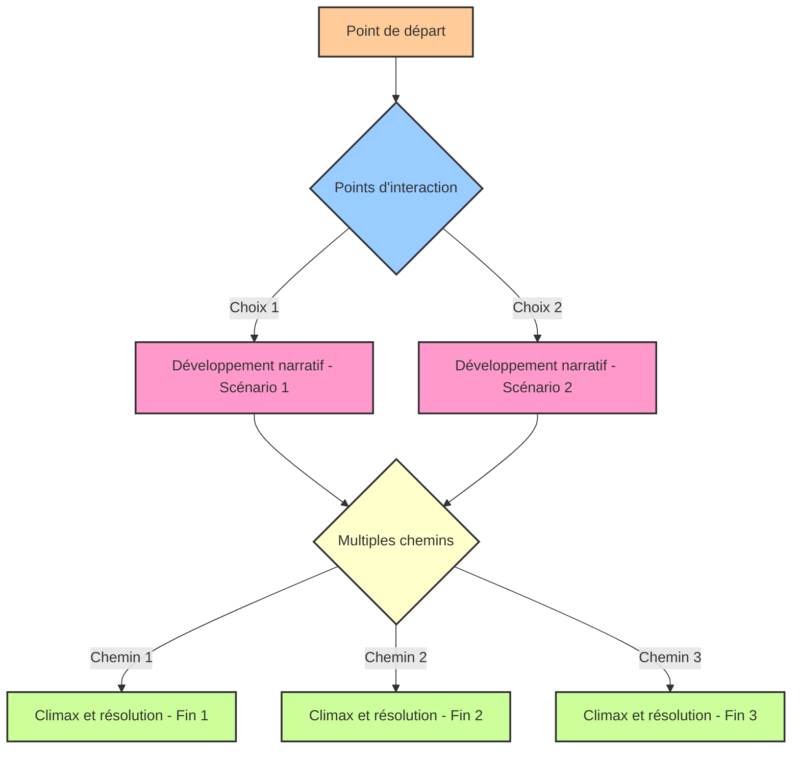

# Le narratif dans l'interactif

Le scénario narratif joue un rôle clé dans la scénarisation d’une installation interactive, car il définit l’arc narratif et l’expérience vécue par l’utilisateur. Contrairement aux formes narratives traditionnelles (comme le cinéma ou le théâtre), le scénario narratif d'une installation interactive doit non seulement raconter une histoire, mais aussi intégrer des éléments d'interaction, permettant à l'utilisateur de devenir un acteur au sein de cette histoire.

## Définir le scénario narratif

Le scénario narratif est la structure qui guide l’interaction entre l’utilisateur et l’installation. Il s'agit de concevoir une séquence d’événements ou d’actions qui stimulent l'engagement du public et le plongent dans un récit immersif. Ce type de scénario inclut généralement plusieurs branches possibles en fonction des choix ou des actions des utilisateurs.

### Éléments constitutifs du scénario interactif narratif

#### Le point de départ

Il est essentiel d’établir le contexte initial pour situer l’utilisateur dès son entrée dans l’espace. Cela peut inclure des éléments visuels, sonores ou physiques qui donnent des indices sur l’histoire et sur le rôle que l’utilisateur est appelé à jouer. 

#### Les points d'interaction

Une installation interactive repose sur des points d'interaction clés, où les utilisateurs influencent le déroulement du scénario. Ces points doivent être clairement définis et intégrés de manière fluide dans le récit pour permettre une interaction intuitive.

#### Le développement narratif 

Le scénario narratif doit inclure une progression dans laquelle les actions de l’utilisateur influencent les événements. L’installation doit donner un retour clair à chaque action, qu'il soit immédiat (visuel, sonore, tactile) ou différé (évolution de la narration).

#### Les multiples chemins

Un aspect central du scénario interactif est de permettre différentes possibilités d'évolution du récit. Ces choix peuvent mener à des fins différentes ou à des modifications dans l'expérience, offrant ainsi une expérience unique à chaque utilisateur ou groupe d'utilisateurs.

#### Le climax et la résolution

Comme dans toute structure narrative, le scénario interactif doit avoir un point culminant, ou climax, où les tensions atteignent leur apogée. Cependant, l'utilisateur peut lui-même créer ou modifier ce climax par ses choix. La résolution doit ensuite venir conclure l'expérience de manière satisfaisante, en fonction des choix faits par l’utilisateur.

### Exemple de développement narratif dans un scénario interactif 

### Stratégies de développement

#### Raconter avec des actions

Plutôt que de tout expliquer par des dialogues ou des textes, il est recommandé d’utiliser des actions et des réponses interactives pour faire avancer l’histoire. Par exemple, toucher un objet peut révéler une partie de l’histoire ou déclencher un changement dans l’environnement.

#### Utilisation de l’espace et du temps

Le scénario doit être conçu en tenant compte de l’espace physique de l’installation. La position des éléments interactifs et la manière dont l’utilisateur se déplace dans l’espace influencent fortement l’expérience narrative. De même, le temps peut être un facteur de progression, soit de manière linéaire, soit en fonction des actions des utilisateurs.

#### Interaction, rétroaction

Il est important que chaque action de l’utilisateur soit accompagnée d'une rétroaction (feedback), comme une réponse visuelle, sonore ou sensorielle, pour renforcer l'immersion dans l’histoire et rendre l’interaction comprise et plus engageante.

## Récapitulatif

Le scénario narratif est une composante essentielle pour créer des expériences interactives cohérentes et immersives. Il permet non seulement de guider l'utilisateur dans l’histoire, mais aussi de donner du sens aux interactions. Une bonne scénarisation interactive prend en compte l'utilisateur comme co-créateur du récit, offrant ainsi une expérience riche et unique à chaque interaction.