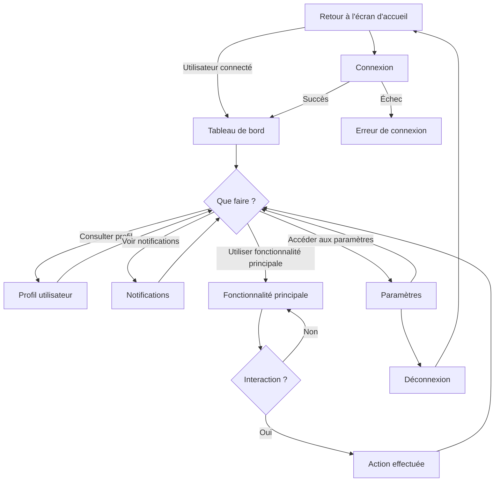
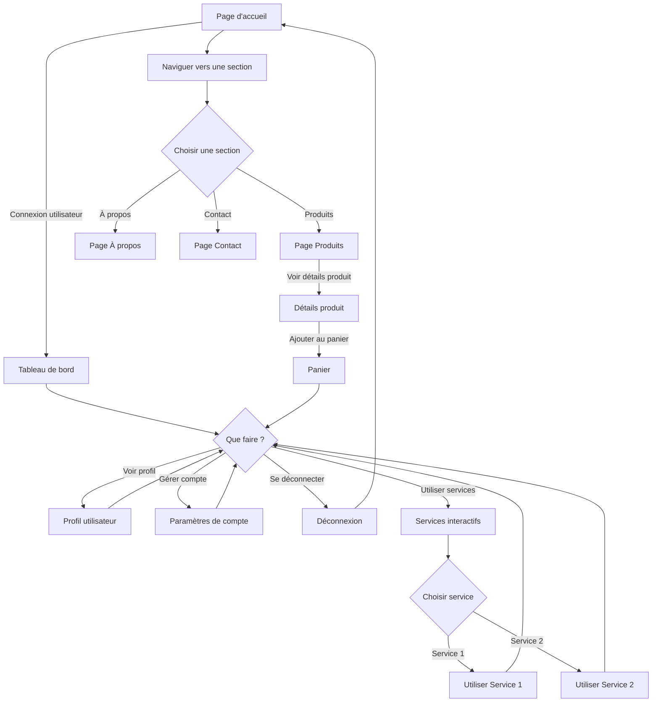
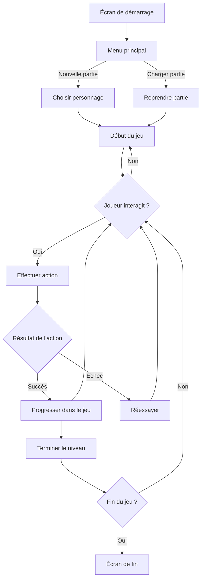
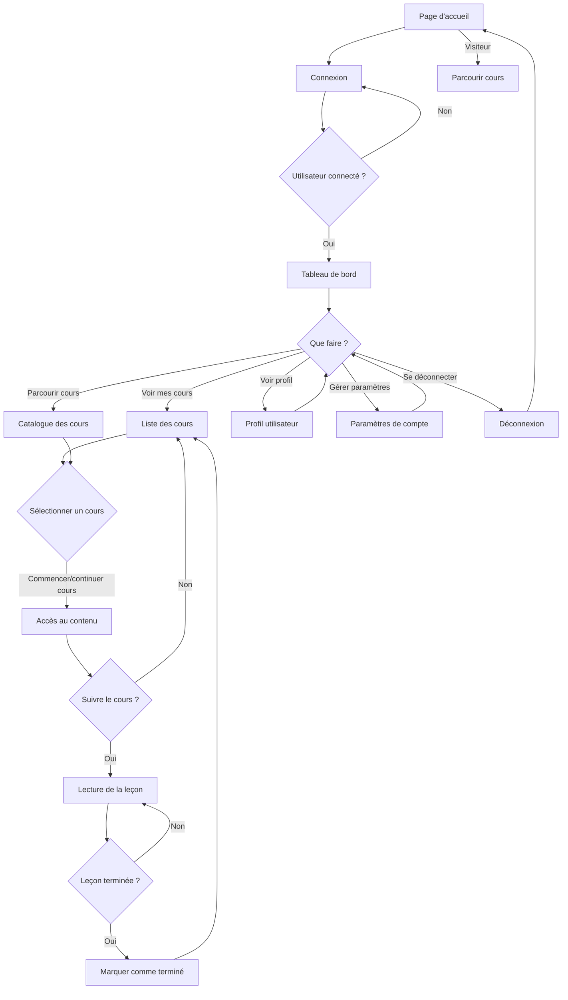
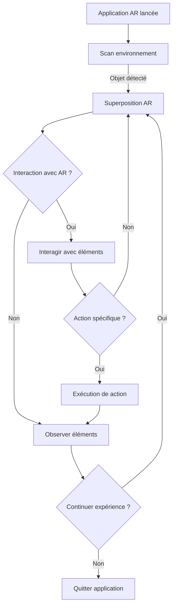
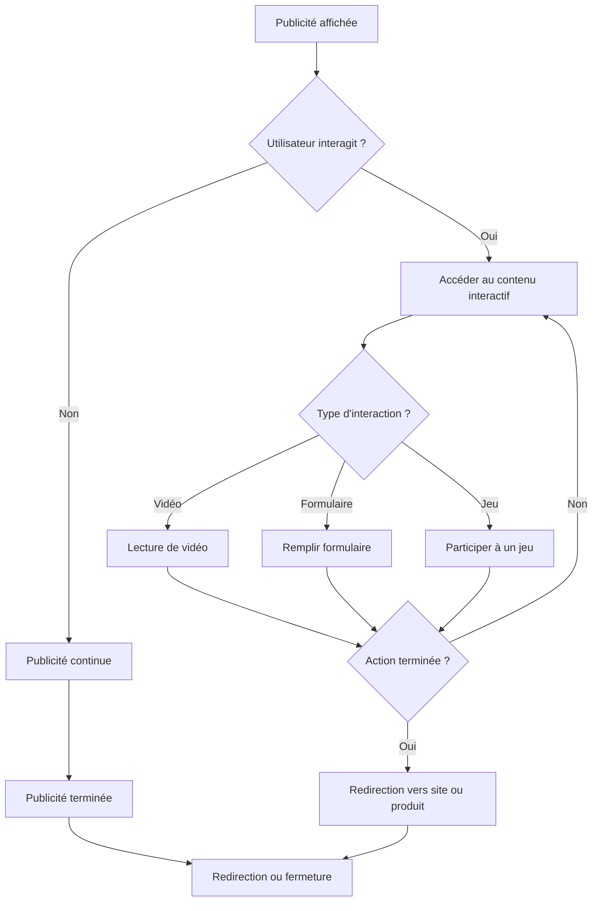
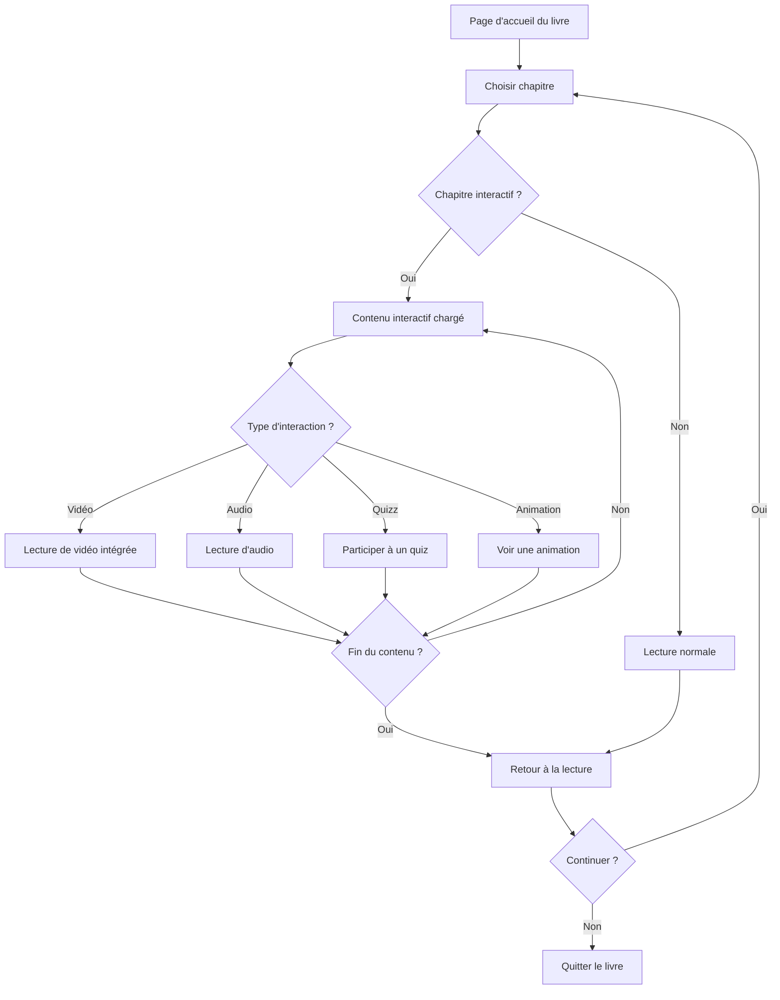

# Scénario interactif

La scénarisation de l'expérience interactive est une étape fondamentale dans la conception multimédias. Elle vise à définir le parcours utilisateur en anticipant ses besoins, ses attentes et ses interactions avec l'objet. Cette démarche permet de créer une expérience personnalisée et engageante.

## Shématisation

La schématisation dans le contexte de la scénarisation interactive est le processus de représentation visuelle des différents éléments, étapes, et interactions d'une expérience interactive ou d'un scénario. Elle permet de structurer et d'organiser les idées de manière claire et compréhensible, facilitant ainsi la planification, le développement, et la communication du projet.

Des outils de création de diagram tel que le language [Mermaid](../../90_outils/80_mermaid/) ou le logiciel [Draw.io](../../90_outils/81_drawio/) peuvent aider à schématiser un scénario interactif.

## Exemples

### Applications Mobiles


Attentions particulière à une navigation intuitive, des interactions tactiles fluides et pertinentes.

### Sites Web Interactifs 



Offrant du contenu dynamique, des fonctionnalités complexes ou des expériences personnalisées.


### Jeux Vidéo




Développer une narration interactive et un arbre de décisions pour l'utilisateur influençant le déroulement.

### Plateformes d'E-learning



Proposer des contenus éducatifs interactifs qui s'adaptent aux actions de l'utilisateur.

### Experience multimédia

```mermaid
graph TD;
    A[Page d'accueil] --> B[Naviguer dans les sections];
    B --> C{Type de contenu ?};

    C -->|Vidéo| D[Visionner une vidéo];
    C -->|Audio| E[Écouter de l'audio];
    C -->|Image| F[Voir une galerie d'images];
    C -->|Texte| G[Lire du texte interactif];
    C -->|3D| H[Interagir avec un objet 3D];

    D --> I{Vidéo terminée ?};
    I -->|Oui| B;
    I -->|Non| D;

    E --> J{Audio terminé ?};
    J -->|Oui| B;
    J -->|Non| E;

    F --> K{Exploration terminée ?};
    K -->|Oui| B;
    K -->|Non| F;

    G --> L{Texte terminé ?};
    L -->|Oui| B;
    L -->|Non| G;

    H --> M{Interaction 3D terminée ?};
    M -->|Oui| B;
    M -->|Non| H;

    B --> N[Quitter l'expérience];
 ```   

### Installations Multimédias


```mermaid
graph TD;

    C{Interaction ?};
    C -->|Audio| D[Sons activés];
    C -->|Vidéo| E[Vidéo lancée];
    C -->|Lumière| F[Effets lumineux];
    C -->|Multimédia| G[Combinaison de médias];

    D --> H{Interaction terminée ?};
    E --> H;
    F --> H;
    G --> H;

    H -->|Oui| I[Retour à veille];
    H -->|Non| C;

Installation interactive présenté dans un musées, une exposition ou des événement.

```

### Réalité Virtuelle (VR) 

```mermaid
graph TD;
    A[Chargement expérience VR] --> B[Écran d'accueil];
    B -->|Commencer| C[Plongée dans l'environnement virtuel];

    C --> D{Détection d'interaction ?};
    D -->|Oui| E[Action de l'utilisateur];
    D -->|Non| C;

    E --> F{Type d'action};
    F -->|Mouvement| G[Mouvement dans l'espace];
    F -->|Manipulation| H[Interaction avec objets];
    F -->|Dialogue| I[Conversation virtuelle];
    F -->|Choix| J[Décision ou chemin];

    G --> K{Succès ?};
    H --> K;
    I --> K;
    J --> K;

    K -->|Oui| L[Continuer expérience];
    K -->|Non| M[Réessayer];

    L --> C;
    M --> E;

Une expérience de réalité virtuelle avec des choix et des embranchements.

```

### Réalité Augmentée (AR)



Une expérience de réalité augmentée créant des environnements via une interactivité temps réelle.

### Publicités Interactives



Permet à l'utilisateur d'interagir pour découvrir davantage un produit ou un service.

### Livres numériques interactifs 



 Expérience littéraire enrichis de médias et d'interactions pour une lecture plus engageante.


