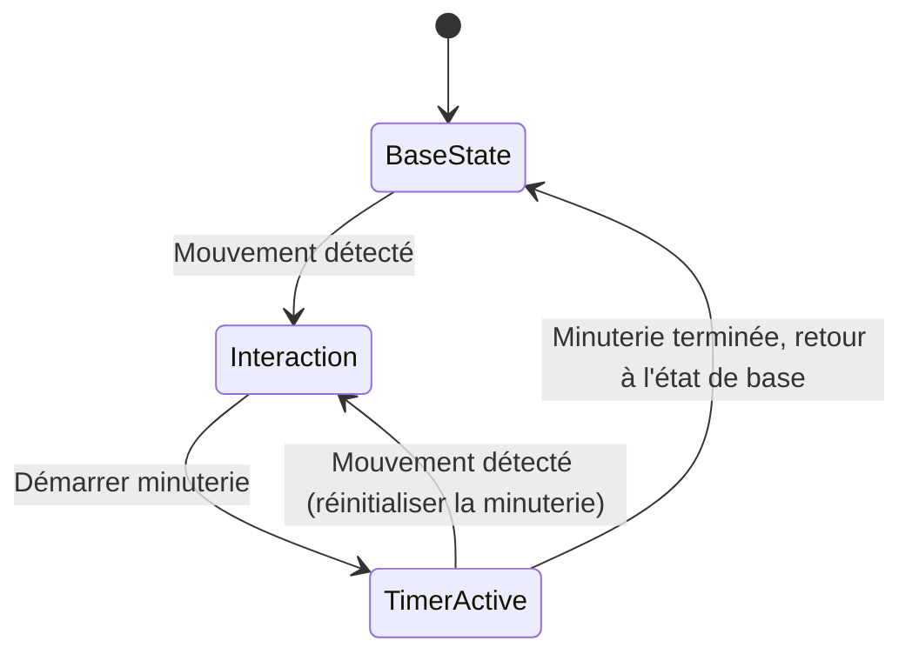
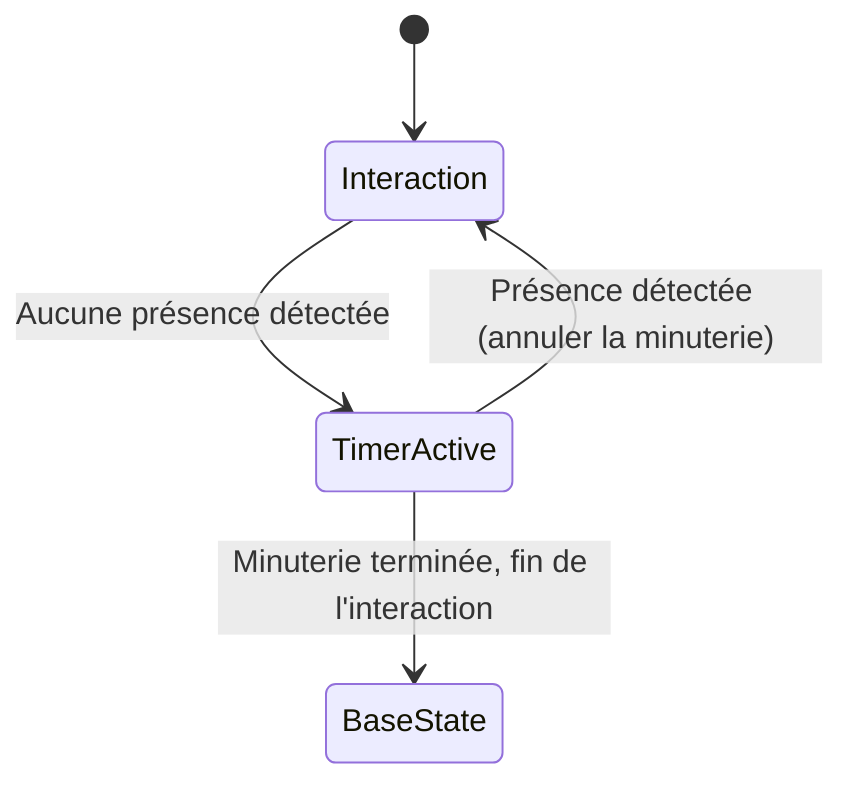

# Technologies

Appréhender les composantes matérielles et logicielles nécessaires pour concevoir des expériences multimédias interactives, et comprendre leur rôle dans la mise en œuvre d'installations immersives.

## Matériel

### Interface interactive

Les interfaces et les capteurs sont des dispositifs de base qui permettent à une installation multimédia d’interagir avec son environnement en collectant des données.

#### Interfaces sur mesure 

Les interfaces graphiques ou physiques, conçues spécifiquement pour permettre aux utilisateurs de contrôler certains aspects de l’installation.

* Boutons
* Potentiomètres
* Encodeurs de rotation
* Interface tactile

#### Capteurs de mouvement 

Utilisés pour détecter les déplacements d'un corps radiant (ex. humain) dans un espace.

* PIR (Passive Infrared Sensor)

> N.B. Le capteur réagit au déplacement et non à la présence.

Exemple : détecter un spectateur qui s'approche pour déclencher une vidéo ou un son.

Ce diagramme montre comment un capteur PIR (détecteur de mouvement) déclenche une interaction, et comment une minuterie est réinitialisée si un mouvement est détecté avant la fin du délai.

#### Capteurs de présence

Utilisés pour détecter la présence d'un corps dans un espace.

* Infrarouge actif
* Laser
* Ultrasons (Sonar)

Exemple : détecter la présence d'un spectateur devant un écran pour déclencher la vidéo ou un son tant qu'il est présent.

Ce diagramme montre comment un détecteur de présence active une interaction, et lorsqu'aucune présence n'est détectée, une minuterie démarre pour finir l'interaction.

#### Caméras de tracking 

Capturent le mouvement ou la profondeur de l’espace pour analyser les actions des utilisateurs.

* Webcams (RGB)
* Caméras infrarouges (IR)
* Kinect (RGB, IR, Profondeur)
* Oak-D (RGB, IR, Profondeur, AI)

#### LIDAR  

Capteurs avancés permettant une cartographie 3D en temps réel de l’espace environnant, détectant les distances et les mouvements à distance.

#### Capteurs biométriques 

Captent les signes vitaux pour adapter le contenu en fonction des émotions ou de l’état physique de l’utilisateur.

* Cardiofréquencemètre 
* Détecteurs de respiration

### Processeurs

Les processeurs permettent de traiter les données collectées par les capteurs et d'exécuter les programmes interactifs.

#### Stations de travail multimédia 

Nécessaires pour le traitement en temps réel des médias riches (vidéo, audio, projection).

* PC avec GPU dédié
* Mac

#### Ordinateurs embarqués 

Utilisés pour gérer les capteurs et exécuter des programmes simples ou en temps réel à proximité de l'interaction.

* Raspberry Pi 
* NUC
* Ordinateur de petit format SFF 
* Lecteur multimédia (ex. Brightsign)

#### Microcontrôleurs 

Utilisés pour des tâches spécifiques de calcul en temps réel, comme le contrôle des lumières ou des moteurs dans des installations interactives.

* Arduino
* ESP32 (m5Stack Atom)
* Teensy

### Diffusion

Les systèmes d'affichage et de sonorisation sont utilisés pour diffuser les médias (vidéo, son, lumière) et créer une expérience immersive.

#### Vidéo 

Utilisés pour diffuser des vidéos interactives, des images animées, ou des informations.

* Projecteurs haute résolution 
* Télévision haute résolution
* Écrans LED 
* Mélangeurs vidéo

#### Audio

Utilisés pour diffuser du son, de la musique, ou des vibrations.

* Hauts-parleurs actifs
* Hauts-parleurs passifs (requiert amplification)
* Cartes de son multi-canaux
* Microphones
* Mélangeurs audio

#### Lumières

Permettent de créer des environnements lumineux dynamiques.

* Systèmes d'éclairage DMX 
* LEDs adressables

## Logiciel

### Programme interactif

Le programme interactif est au cœur de l'installation, il coordonne l'ensemble des composants matériels et logiciels pour répondre aux interactions.

#### Logiciels de création multimédia 

Utilisés pour développer des expériences interactives où les actions des utilisateurs déclenchent des événements audiovisuels en temps réel.

* TouchDesigner
* MAX/MSP
* Pure Data
* Unreal Engine
* Blender

#### Systèmes de contrôle d’éclairage  

Permettent de synchroniser les projections vidéo, l’éclairage, et le son avec les actions des utilisateurs.

* QLC+
* QLab
* Lightkey

### Algorithmes de détection

Ces algorithmes permettent de traiter les données reçues des capteurs et de détecter des événements en temps réel, déclenchant des actions spécifiques dans l'installation.

#### Analyse d'image et de mouvement 

Utilisés pour reconnaître les mouvements, les formes, ou les visages dans les flux vidéo en direct, et déclencher des changements dans l'expérience interactive.

* OpenCV 
* TensorFlow

#### Détection de présence et suivi 

Appliqués pour détecter les comportements des utilisateurs (comme l’analyse de parcours ou les temps de présence) et adapter le contenu multimédia en conséquence.

* Algorithmes de machine learning

#### Gestion des données biométriques 

Utilisés pour interpréter les signaux biologiques capturés par des capteurs (fréquence cardiaque, respiration) et adapter l’ambiance sonore ou visuelle en fonction de l’état émotionnel ou physique des participants.

### Média (vidéo, son)

Les contenus multimédias (vidéo et son) sont l'élément visible et audible de l'expérience interactive. Ils doivent être soigneusement synchronisés avec les événements capturés et générés par le programme.

#### Vidéo interactive 

Les vidéos peuvent être mappées sur des surfaces physiques ou projetées en réponse aux actions des utilisateurs (via du vidéo mapping ou de la projection 360°).

#### Audio spatialisé

Le son peut être dynamique et réagir aux mouvements des utilisateurs dans l’espace, grâce à des systèmes comme **Ambisonics** ou **Wave Field Synthesis** qui permettent de simuler un environnement sonore tridimensionnel.

#### Médias génératifs 

Les logiciels comme **TouchDesigner** ou **MAX/MSP** permettent de générer du contenu sonore ou visuel en temps réel, réagissant de manière unique à chaque interaction utilisateur.

## Récapitulatif 

L'intégration efficace des composants matériels et logiciels est essentielle pour la création d'expériences multimédias interactives engageantes. Chaque élément technologique joue un rôle clé dans la fluidité des interactions entre les utilisateurs et l’installation, rendant l'expérience immersive, intuitive et captivante.
