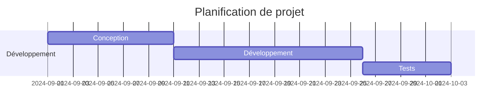
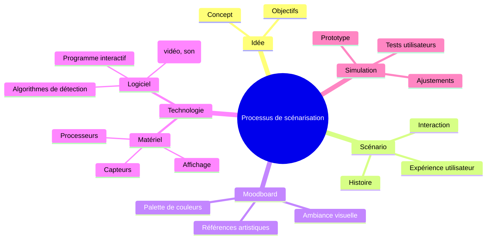

# Mermaid

Mermaid est un langage de balisage léger qui permet de créer des diagrammes dynamiques directement dans des fichiers Markdown. Son intégration avec Markdown le rend particulièrement puissant pour générer des diagrammes lisibles dans des environnements de développement collaboratif comme GitHub. Mermaid permet de créer des diagrammes de flux, des diagrammes de Gantt, des organigrammes, des diagrammes de séquence, et bien plus encore, simplement en utilisant du texte.


Mermaid est une solution pratique et efficace pour intégrer des diagrammes dans la documentation Markdown sur GitHub. Son approche en texte brut, sa prise en charge native par GitHub, et sa compatibilité avec les flux de travail modernes en font un choix privilégié pour créer, maintenir et publier des diagrammes de manière fluide et instantanée.


## Intégration de Mermaid 


### Création Rapide et Facile de Diagrammes
   Mermaid permet de créer des diagrammes complexes uniquement en utilisant du texte. Cela évite d'avoir à recourir à des outils graphiques et facilite l'écriture de diagrammes directement dans les fichiers Markdown.

### Support Natif dans GitHub
   Depuis que GitHub prend en charge nativement Mermaid, il est possible de créer des diagrammes Mermaid dans des fichiers Markdown et de les voir instantanément rendus lors de la publication. Cela supprime le besoin d'outils tiers pour visualiser les diagrammes et permet une intégration plus fluide dans les projets de documentation.


### Simplicité de Mise à Jour
   Les diagrammes Mermaid sont générés à partir de texte brut. Cela signifie qu'ils peuvent être facilement modifiés comme n'importe quel autre contenu texte dans un fichier Markdown. En utilisant Git, chaque changement apporté au diagramme est suivi de manière transparente, et plusieurs contributeurs peuvent collaborer efficacement.

### Évolutivité et Modularité
   Mermaid permet de créer une variété de diagrammes, depuis les simples organigrammes jusqu'aux diagrammes plus complexes comme les diagrammes de Gantt. Cela en fait un outil polyvalent pour de nombreux types de documentation technique ou organisationnelle, tout en restant dans un format Markdown compatible avec GitHub.


### Compatibilité Multiplateforme
   Puisque Mermaid est basé sur du texte, il peut être utilisé sur n'importe quelle plateforme ou éditeur prenant en charge Markdown. Cela signifie qu'aucun logiciel supplémentaire n'est nécessaire pour visualiser ou éditer les diagrammes, ce qui facilite son utilisation dans différents environnements de développement.


## Exemple d'Utilisation de Mermaid dans Markdown

Voici un exemple simple de diagramme Mermaid dans un fichier Markdown 


```
graph TD;
    A-->B;
    A-->C;
    B-->D;
    C-->D;
```


Qui devient lorsque 'mermaid' est defini comme language du bloc de code


Le diagramme ci-dessus, lorsqu'il est intégré dans un fichier Markdown hébergé sur GitHub, est automatiquement rendu comme un diagramme de flux visuel.


### Comment créer un diagramme Mermaid dans un fichier Markdown ?

Si vous souhaitez ajouter des diagrammes dans un fichier Markdown à l'aide du langage Mermaid, suivez les étapes ci-dessous :


#### 1. **Ajouter un diagramme Mermaid dans le fichier Markdown**
   - Utilisez une syntaxe simple pour définir votre diagramme Mermaid. Dans un fichier Markdown, Mermaid est encadré par des balises de code. Voici la structure de base :

```
```mermaid
// Insérer votre diagramme Mermaid ici
```

- **Important** : Assurez-vous que les balises de code qui encadrent votre diagramme sont écrites avec trois accents graves `` ` `` et que `mermaid` est bien spécifié après la première série d'accents graves.

#### Écrire un diagramme

À l'intérieur des balises code Mermaid, écrivez le code qui correspond au type de diagramme que vous souhaitez créer. Voici quelques exemples :

##### Exemple 1 : Diagramme de flux

```


Cela génère un diagramme de flux avec des connexions entre les éléments A, B, C, et D.


##### Exemple 2 : Diagramme de Gantt

```


Ce code génère un diagramme de Gantt simple avec des tâches et des dates.


##### Exemple 3 : Diagramme de type Mindmap

https://mermaid.js.org/syntax/mindmap.html



#### 4. **Valider le rendu sur GitHub ou Docsify**
   - Une fois que vous avez ajouté le diagramme Mermaid à votre fichier Markdown, committez-le dans votre dépôt GitHub. Ensuite, affichez le fichier sur GitHub pour voir le diagramme rendu automatiquement.

#### 5. **Édition et mise à jour**
   - Puisque Mermaid est en texte brut, vous pouvez facilement modifier votre diagramme en éditant simplement le fichier Markdown. Les changements seront immédiatement visibles lorsque le fichier est reconsulté sur GitHub.

#### Conclusion
En suivant ces étapes simples, vous pouvez intégrer facilement des diagrammes Mermaid dans vos fichiers Markdown et les rendre directement visibles sur GitHub. Cela simplifie la documentation de flux de travail, de processus, ou de projets dans un format visuel et facile à maintenir.


## Références

* https://mermaid.js.org/intro/
* https://mermaid.live/edit