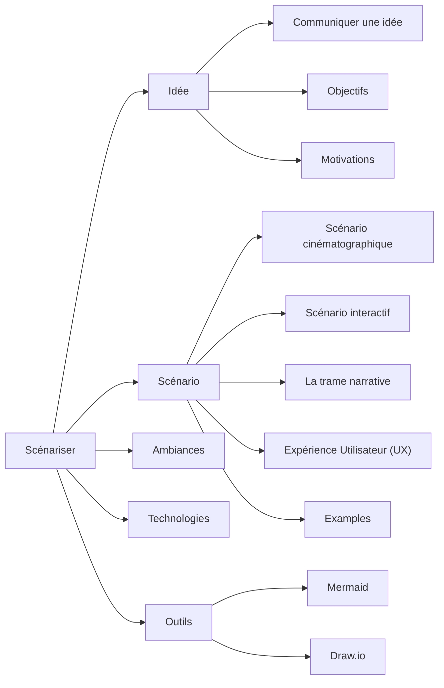

# Scénariser

<!-- generateSubNav -->
* [Idée](/contenus/2_scenarisation/10_idee/)
    * [Communiquer une idée](/contenus/2_scenarisation/10_idee/10_concept/)
    * [Objectifs](/contenus/2_scenarisation/10_idee/20_objectifs/)
    * [Motivations](/contenus/2_scenarisation/10_idee/30_motivations/)
* [Scénario](/contenus/2_scenarisation/20_scenario/)
    * [Scénario cinématographique](/contenus/2_scenarisation/20_scenario/10_cinema/)
    * [Scénario interactif](/contenus/2_scenarisation/20_scenario/20_interactif/)
    * [La trame narrative](/contenus/2_scenarisation/20_scenario/30_narratif/)
    * [Expérience Utilisateur (UX)](/contenus/2_scenarisation/20_scenario/40_ux/)
    * [Examples](/contenus/2_scenarisation/20_scenario/50_exemple/)
* [Ambiances](/contenus/2_scenarisation/30_ambiances/)
* [Technologies](/contenus/2_scenarisation/40_technologie/)
* [Outils](/contenus/2_scenarisation/90_outils/)
    * [Mermaid](/contenus/2_scenarisation/90_outils/80_mermaid/)
    * [Draw.io](/contenus/2_scenarisation/90_outils/81_drawio/)
<!-- generateSubNavEnd -->

<!-- generateMermaidNav -->

<!-- generateMermaidNavEnd -->
