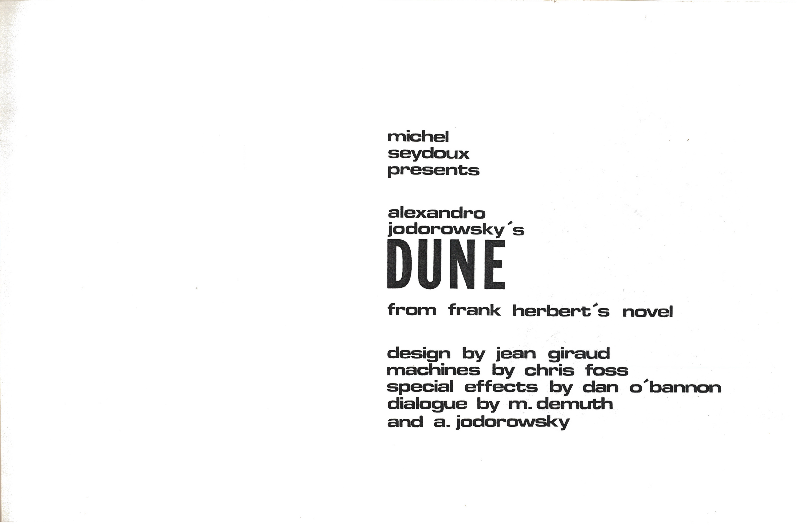

# Scénarimage de DUNE, Jodorowsky

Le *Dune* de Jodorowsky est un projet cinématographique légendaire, souvent qualifié de "meilleur film jamais réalisé" en raison de son influence durable sur le cinéma de science-fiction, malgré le fait qu’il n’ait jamais vu le jour. Ce scénarimage est essentiel pour plusieurs raisons :

### 1. **Vision artistique et audace narrative**
   Jodorowsky a imaginé une adaptation de *Dune* extrêmement ambitieuse, non seulement pour l'époque mais aussi pour le genre de la science-fiction. Son approche transcendait la simple adaptation d'un roman, cherchant à en faire une expérience quasi mystique et psychédélique. Le scénario et le storyboard reflétaient une compréhension visuelle immersive et symbolique, visant à provoquer chez le spectateur une transformation personnelle. 

### 2. **Collaborations artistiques inédites**
   Le projet a rassemblé des créateurs de premier plan, comme le dessinateur français Moebius pour le storyboard, H.R. Giger pour les designs des Harkonnens, Chris Foss pour les vaisseaux, et Dan O'Bannon pour les effets spéciaux. Cet ensemble de talents a donné naissance à un langage visuel unique et reconnaissable qui a influencé d'innombrables films de science-fiction ultérieurs, notamment *Alien*, *Blade Runner*, et même *Star Wars*.

### 3. **Un storyboard qui devient une référence**
   Le scénarimage de *Dune*, réalisé par Moebius, est à la fois un chef-d'œuvre artistique et un document de référence. Chaque scène, minutieusement pensée et illustrée, raconte l’histoire visuellement et donne aux spectateurs et aux réalisateurs un aperçu du potentiel du film. Ce storyboard a circulé dans les studios d'Hollywood après l'annulation du projet, influençant des générations de créateurs et marquant l'histoire du cinéma sans même avoir été porté à l'écran.

### 4. **Une vision prophétique du cinéma de science-fiction**
   Jodorowsky envisageait *Dune* comme une œuvre à la portée universelle, défiant les conventions narratives et visuelles de l’époque. Sa conception du film dépasse les simples scènes d'action ou d'intrigue linéaire : il voulait que chaque image, chaque son, transcende le genre pour explorer des thèmes philosophiques et spirituels profonds. Bien que ce film ne se soit jamais concrétisé, l'influence de ce storyboard reste palpable dans le cinéma de science-fiction, redéfinissant ce qui est possible dans la narration visuelle et l'intégration d'effets artistiques.

### 5. **Impact culturel et académique**
   Enfin, le *Dune* de Jodorowsky est devenu un cas d’étude dans le domaine du cinéma et des arts visuels. Il illustre comment un projet peut influencer une industrie entière même sans aboutir, et le scénarimage sert de ressource précieuse pour comprendre comment des idées révolutionnaires peuvent inspirer et transcender leurs propres limitations. 

En somme, le scénarimage de *Dune* par Jodorowsky reste une référence en termes d’imaginaire et de design dans le cinéma, rappelant que l'influence d'une œuvre peut dépasser largement sa réalisation et redéfinir les standards visuels d'un genre.

## Références 

* https://archive.org/details/jodorowskys-dune_202301

* https://archive.org/details/jodorowsky-dune

