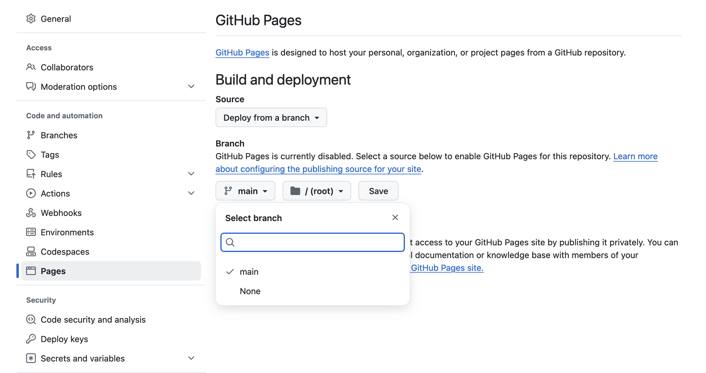
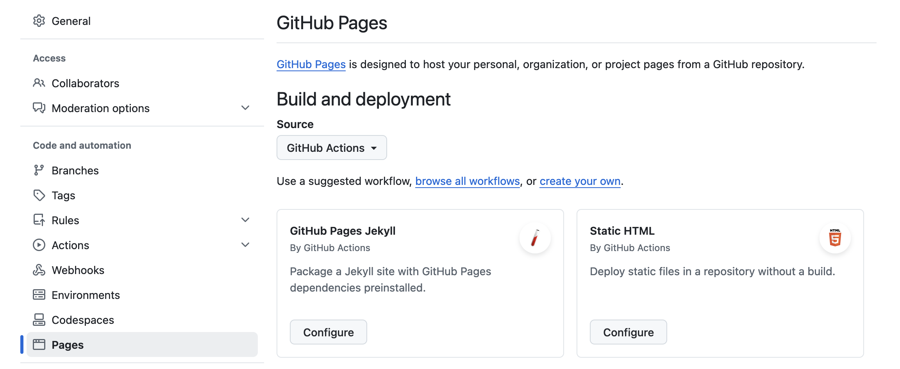
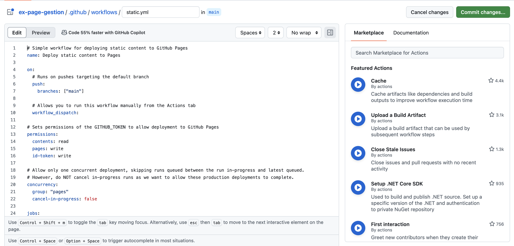
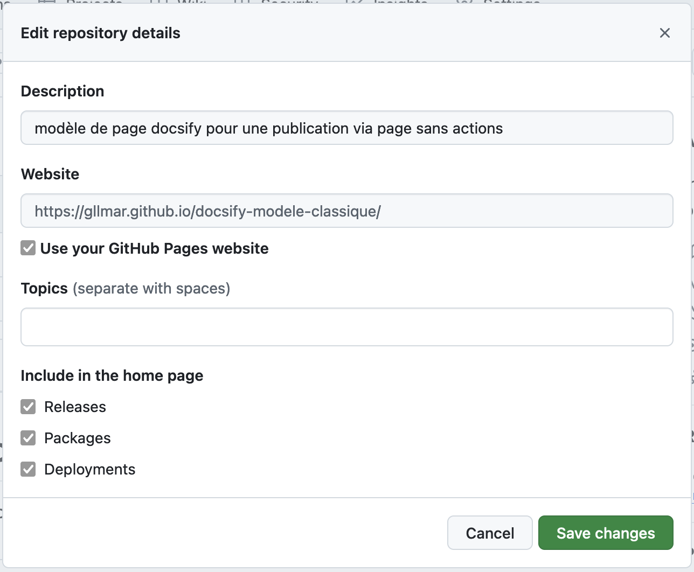

# Publication de Pages GitHub

GitHub Pages est un service gratuit offert par GitHub qui permet de publier des sites web directement à partir d’un dépôt GitHub. Ce service est couramment utilisé pour héberger des sites personnels, des pages de projets ou des blogs.

### Publication de Pages Statique HTML

Le moyen le plus simple de publier une page sur GitHub est de déposer des fichiers HTML statiques dans un dépôt GitHub. Le service GitHub Pages servira automatiquement ces fichiers en tant que site web.

### Étapes 

####  Création du Dépôt 

Créez un nouveau dépôt sur GitHub. Le nom du dépôt peut être libre ou peut suivre le format username.github.io pour créer un site personnel.

#### Ajout des Fichiers

Ajoutez vos fichiers HTML, CSS, JavaScript et autres ressources dans le dépôt. Assurez-vous que le fichier principal de votre site soit nommé index.html.

####  Types de déploiement 

#####  Classique

Déploiement depuis la branche (méthode classique) est simple et direct : il suffit de choisir une branche spécifique (généralement main, master, ou gh-pages) dans les paramètres de GitHub Pages, et tous les fichiers de cette branche seront automatiquement servis comme site web. Cette méthode est idéale pour les projets simples ou statiques où les fichiers sont prêts à être publiés dès qu'ils sont poussés sur GitHub.

* Allez dans les paramètres du dépôt (Settings).
* Sous la section "Pages", choisissez la branche principale (main ou master) comme source, et définissez le dossier racine (/) ou /docs comme emplacement des fichiers.

##### Github Actions

le déploiement via GitHub Actions offre une flexibilité et une automatisation accrues. Avec cette méthode, vous configurez un workflow CI/CD (Intégration Continue/Déploiement Continu) qui peut inclure des étapes de construction, de tests, ou de génération de contenu avant le déploiement. Par exemple, pour un site Jekyll, GitHub Actions permet de construire le site à partir des fichiers source Markdown et de pousser le résultat final dans la branche de déploiement. Cette approche est particulièrement utile pour les projets plus complexes ou dynamiques, où un simple push ne suffit pas pour obtenir un site prêt à être publié. Elle garantit également un déploiement cohérent et automatisé à chaque modification du code.

Choisir déploiement statique

Committer l'action suggérée

####  Accès à la Page 

Une fois les changements appliqués, GitHub générera une URL pour votre site (par exemple, https://username.github.io/repository-name), qui sera automatiquement mis à jour chaque fois que vous pousserez des modifications au dépôt.

### Afficher un lien vers la page  

